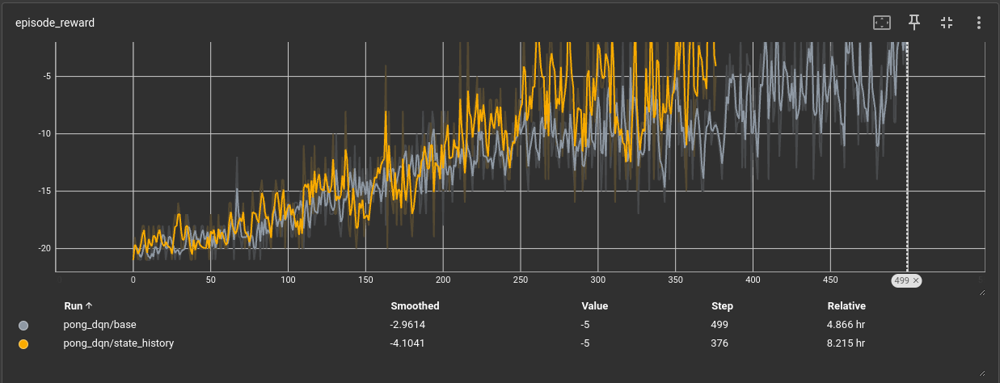

### 10/12/2024
* Training now takes more than 2x longer.
* 
* Possible reasons for 2x slowdown:
    * Conv input size for getting action is now 4x32x32 (4 frames of state history) instead of 1x32x32. (No solution here.)
    * Deque in training loop, with np.stack happening 2x per step (to get state and next_state from obs hsitory).
    * Maybe move each state to cuda when discovered in training loop
        * Benefit from faster tensor ops (hopefully faster than np.stack) and no moving to cuda during training step
        * Disadvantages: many more slower individual moves to gpu, also will want to see if we have enough memory for this.
    * Will want to benchmark with kernprof
* Thinking about increasing learning rate and overall HyperParams, want to balance HyperParam tuning with continuing with Policy Gradients though.
* Increased black and flake8 max line length to 100. More readable I think.

### 10/11/2024
* Created dev log for logging experiments, setbacks, ideas, and progress.
* Progress
    * save HyperParams to json: easier to track experiments
    * Checked resizing pong frames to 32x32. Playable, also checked 48x48 and 64x64.
    * Realized that feeding frame diffs to network is bad b/c if the agent doesn't move, you can't tell where your own paddle is. Switching to feeding 4 frames instead.
    * Set off run with only change being feeding state history instead of state diff.
* Ideas
    * Create ReplayMemory class with data loading multiprocessing queue
    
